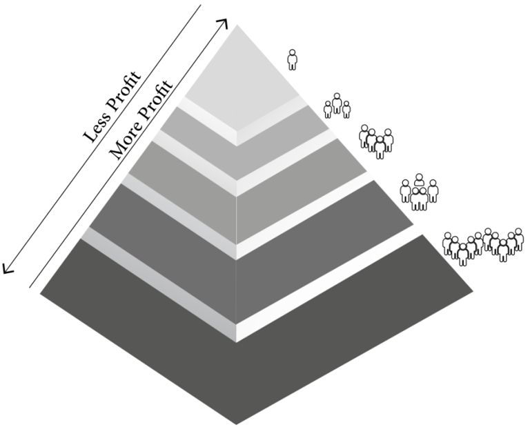

# منطق النظام العام

**تقنية البلوكشين والتطبيقات الواقعية**

في AVANZO، نؤمن بأن تقنية البلوكشين يجب أن تلبي احتياجات العالم الواقعي، من خلال سد الفجوة بين التكنولوجيا اللامركزية والمتطلبات اليومية. ومن خلال دمج الذكاء الاصطناعي في منصتنا القائمة على البلوكشين، يمكننا التنبؤ باتجاهات السوق، تعزيز قرارات الاستثمار، وتعظيم العوائد للمستخدمين.

منصتنا تربط المستثمرين حول العالم، وتوفر لهم التحكم الكامل في استثماراتهم، طرق الدفع، وقرارات الاستثمار المستقبلية—ميزات لا يمكن تحقيقها مع الأنظمة التقليدية.

يوضح الشكل 2 سير عمل النظام:

○ يقوم جميع حاملي رموز $AVAN بالتصويت على اقتراح يحتوي على ثلاثة خيارات استثمارية.

○ يتم اختيار الاقتراح الذي يحصل على أكبر عدد من الأصوات، ويتم إنشاء مجموعة استثمارية.

○ يساهم المستثمرون بأموال تعادل قيمة العقار.

○ بمجرد اكتمال المجموعة، يتم تحويل الأموال إلى المحفظة المخصصة للشراء، ليتم استكمال عملية شراء العقار.

○ يولد العقار عوائد سنوية توزع كالتالي: 70% للمستثمرين و30% للشركة بعد خصم النفقات.

يقوم الذكاء الاصطناعي بتعزيز هذه العملية من خلال التنبؤ بأداء العقارات، تحسين خيارات الاستثمار، وضمان توزيع الأموال في الوقت المناسب.

علاوة على ذلك، يتيح نموذج DAO للمستثمرين اختيار العوائد بالعملة الرقمية المفضلة لديهم أو بعملة مستقرة مرتبطة بالدولار، مما يضيف مرونة وشفافية.

<figure><figcaption>
Figure "2"
</figcaption></figure>
