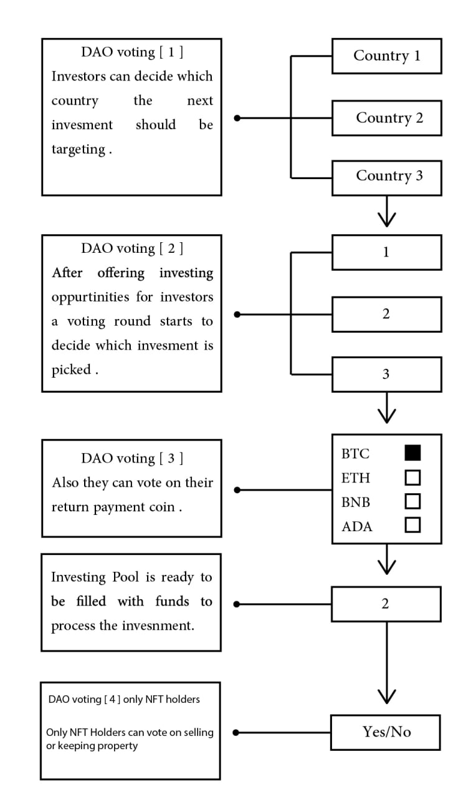

# AI-Driven Investment Process

With our innovative smart contract system, enhanced by **AI optimization**, the investment process becomes faster, safer, and more accessible. Here’s how AI improves the system:

* **Property Selection**: AI models analyze extensive datasets, including market trends, demographics, and economic conditions, to recommend the most profitable investment opportunities. Investors can vote on properties through DAO, backed by AI insights.
* **Currency Flexibility**: AI-powered systems allow investors to choose their preferred return currency (e.g., AVAN, BTC, ETH, BNB), optimizing the distribution process for tax efficiency and market conditions.
* **Portfolio Maintenance**: AI evaluates annual returns and suggests whether to maintain or reinvest in the pool. Investors receive tailored insights, simplifying complex decisions and maximizing ROI.

